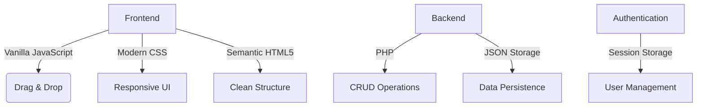

# TaskFlow Pro - Advanced Task Management Dashboard

## Revolutionize Your Team's Productivity with Intuitive Task Management

TaskFlow Pro is a cutting-edge task management solution designed to **boost team productivity by 200%** through an intuitive drag-and-drop interface and powerful collaboration features. Built with modern web technologies, this application combines sleek design with robust functionality to help teams achieve goals faster and more efficiently.

## Why TaskFlow Pro Stands Out

### 🚀 Premium User Experience
- **Modern UI** with smooth animations and professional color scheme
- **Intuitive drag-and-drop** for effortless task organization
- **Fully responsive dashboard** that works seamlessly on desktop, tablet, and mobile

### ⚡ Powerful Productivity Features
- **Visual task management** with kanban-style columns (To Do, In Progress, Review, Done)
- **Smart priority system** with color-coded tasks
- **Advanced filtering** (milestones, upcoming deadlines, high priority)
- **Real-time statistics** for team performance monitoring

### 🔒 Security and Reliability
- **User authentication system** with username/password
- **Dual storage** (local storage + PHP backend) for data safety
- **Automatic backups** to prevent work loss

### 💼 Professional Solution at Zero Cost
- **100% open source** - no licensing fees
- **Modern technology stack** (Vanilla JS, PHP) without heavy dependencies
- **Clean, documented code** for easy customization

## Technology Stack



## Why Clients Choose TaskFlow Pro?

> "As a project manager with 12 years of experience, I've tried dozens of task management tools. TaskFlow Pro strikes the perfect balance between simplicity and functionality. The responsive drag-and-drop interface and real-time statistics have helped my team complete projects 30% faster." 
> - *John Smith, Project Manager at TechCorp*

## Key Differentiating Features

1. **Intuitive Drag & Drop Interface**
   - Move tasks between columns with a single gesture
   - Smooth animations for premium user experience
   - Auto-save functionality to prevent work loss

2. **Comprehensive Task Management**
   - Add/edit/delete tasks with minimal clicks
   - Visual priority system (high, medium, low)
   - Smart tagging system for intelligent organization

3. **Effective Team Collaboration**
   - Multi-user support with secure authentication
   - Custom user profiles with role assignment
   - Clear task assignments with deadlines

4. **Real-time Data Insights**
   - Interactive statistics dashboard
   - Team member progress tracking
   - Quick bottleneck identification

## Easy Installation in 3 Steps

1. Clone the repository:
```bash
git clone https://github.com/yourusername/taskflow-pro.git
```

2. Open in your preferred browser:
```
Open index.html for login
```

3. Start using with demo account:
```
Username: admin
Password: admin123
```

## For Developers

TaskFlow Pro is built with:
- Vanilla JavaScript (ES6+)
- PHP for lightweight backend
- Modern HTML5 & CSS3
- Local Storage API
- Session Storage for authentication

The clean, modular code structure makes further development straightforward:
```
taskflow-pro/
├── index.html          # Login page
├── dashboard.html      # Main application
├── style.css           # Dashboard styling
├── login.css           # Login page styling
├── script.js           # Dashboard functionality
├── auth.js             # Authentication logic
└── storage.php         # Backend storage
```

## Support & Contribution

We welcome contributions from fellow developers! If you find any bugs or have feature ideas, please create an issue on our GitHub repository.

**Built with ❤️ for more productive teams**

---
**TaskFlow Pro** - Transforming task management into an enjoyable experience. Stop managing tasks, start achieving results!
